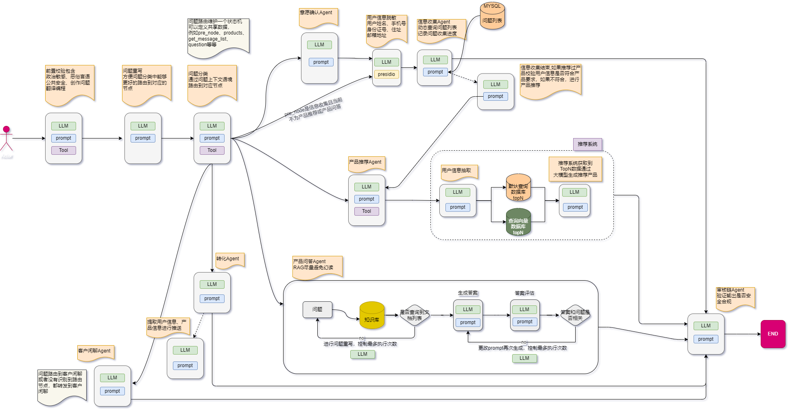
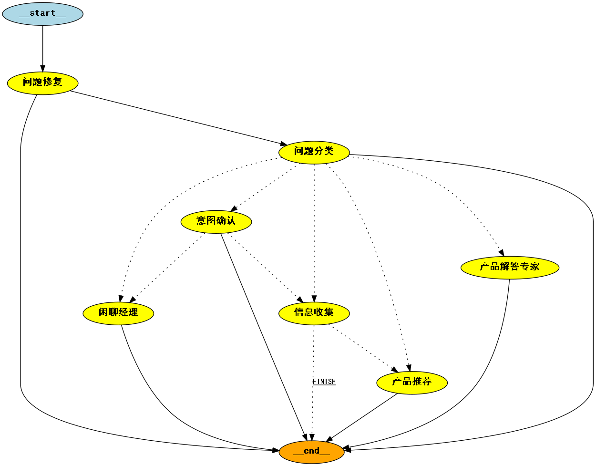
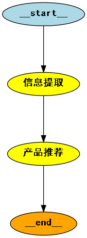

# langgraph_fly_base

基于 **LangGraph 1.x** 的智能贷款销售客服工作流：多轮对话、知识库 RAG、双库并行产品推荐、信息确认与客户转化。

[大模型学习记录](https://juejin.cn/column/7379059739118878732)

## 技术栈

| 类别 | 选型 |
|------|------|
| Web | FastAPI + Uvicorn + Jinja2 |
| 工作流 | LangGraph 1.x + SQLite Checkpoint |
| LLM | DashScope OpenAI 兼容模式（qwen-plus）/ 智谱回退 |
| 向量库 | Milvus（稠密 + SPLADE 稀疏混合检索） |
| ORM | SQLAlchemy 2.x + SQLite |
| 日志 | logging + trace_id 链路追踪 |

## 主工作流

```
问题修复 → 问题分类 ─┬→ 闲聊经理
                     ├→ 产品解答专家（KB RAG）
                     └→ 意图确认 → 信息收集(4项) → 信息确认 → 产品推荐(双库 TopN) → 客户转化
```

- **信息收集**：贷款金额、期限、用途、资质等 4 项，收集完成前不会进入推荐。
- **信息确认**：汇总已收集信息，用户确认后才进入推荐（避免误推）。
- **产品推荐**：并行检索 `recommend_product` 与默认 KB 集合，TopN 合并去重。
- **客户转化**：推荐后引导留资/预约，输出客服电话与网点提示。
- **敏感信息**：Presidio 脱敏仅在信息收集阶段生效，其他节点不脱敏。

架构图见 、、。

## 目录结构（核心）

```
app/                    # FastAPI 入口、路由、中间件
  main.py               # 应用 lifespan、静态资源挂载
  routers/chat.py       # 聊天页 + SSE 流式接口
  routers/kb.py         # 知识库上传/检索/建库
sale_app/
  core/
    agent/              # 各 LangGraph 节点实现
    mutil/flow_graph.py # 主图与子图编排
    kb/                 # 文档解析、分块、向量写入
  database/             # 产品推荐 SQL + Milvus 检索
  secrity/              # 前置安全与敏感信息脱敏
config.py               # 环境变量与默认值
storage/                # 会话 checkpoint、KB 文件、图片
tests/                  # pytest 单元/集成测试
```

## 主要接口

| 路径 | 说明 |
|------|------|
| `GET /health` | 健康检查 |
| `GET /api/chat` | 聊天页面 |
| `POST /api/chat/stream` | SSE 流式对话 |
| `GET/POST /kb/upload_file` | 文档上传 |
| `GET/POST /kb/search` | 召回测试 |
| `GET/POST /kb/create_collection` | 创建 Milvus 集合 |

## 知识库

- 支持 **Word / PDF / Excel** 上传，按 `KB_CHUNK_SIZE` / `KB_CHUNK_OVERLAP` 分块后写入 Milvus。
- 默认 QA 集合：`DEFAULT_KB_COLLECTION=loan_qa`。
- 使用 **分区键** 区分不同文件，检索时过滤，避免相似文档交叉污染。
- 混合检索：稠密向量 + SPLADE 稀疏向量，QA 节点使用 `page_content` 作为上下文。

启动后访问：http://127.0.0.1:8000/kb/upload_file


Milvus 可视化（Attu 等）：


## 推荐系统

基于内容的向量相似度推荐，用户偏好与产品标签向量化存储（SPLADE 稀疏 + 稠密混合检索）。

- 推荐集合：`RECOMMEND_COLLECTION_NAME=recommend_product`
- 每库 TopN：`RECOMMEND_TOP_K=5`，双库并行后合并去重

详见 [推荐系统](https://juejin.cn/post/7402137644372344844)。

## 快速开始

### 方式 A：Docker Compose 一键启动（推荐）

```bash
cp .env.example .env
# 编辑 .env，至少填写 LLM_API_KEY（或 ZHIPU_API_KEY）

docker compose up -d --build
```

| 服务 | 地址 |
|------|------|
| 聊天 | http://127.0.0.1:8182/api/chat |
| 知识库 | http://127.0.0.1:8182/kb/upload_file |
| 健康检查 | http://127.0.0.1:8182/health |
| Milvus Attu | http://127.0.0.1:8001 |
| Milvus gRPC | localhost:19530 |

常用命令：

```bash
docker compose logs -f app      # 查看应用日志
docker compose down             # 停止全部服务
docker compose up -d etcd minio milvus attu   # 仅启动 Milvus 栈（本地跑 app）
```

> Docker 内 `app` 服务自动设置 `MILVUS_HOST=milvus`；本地直跑 uvicorn 时仍用 `MILVUS_HOST=localhost`。

### 方式 B：本地 Python 启动

#### 1. 环境

- Python **3.10** 或 **3.11** 推荐
- 已安装并启动 **Milvus**（`docker compose up -d etcd minio milvus attu` 或见根目录 `docker-compose.yml`）

#### 2. 安装依赖

```bash
pip install -r requirements.txt
# 智谱 SDK 与 LangChain 1.x 主栈解耦，需单独安装：
pip install langchain-zhipu==4.1.8 --no-deps
```

#### 3. 配置环境变量

```bash
cp .env.example .env
# 编辑 .env，至少填写 LLM_API_KEY（或 ZHIPU_API_KEY）
```

常用配置项：

```env
# LLM
LLM_API_KEY=sk-xxx
LLM_MODEL=qwen-plus
LLM_ENABLE_REASONING=false          # 分类等简单任务建议关闭以提速

# 问题分类性能
QUESTION_CLASS_FEW_SHOT=1           # 0=最快，1=推荐
QUESTION_CLASS_HISTORY_TURNS=4

# 知识库分块
KB_CHUNK_SIZE=800
KB_CHUNK_OVERLAP=120

# Milvus 与集合
VECTOR_TYPE=milvus
MILVUS_HOST=localhost
MILVUS_PORT=19530
DEFAULT_KB_COLLECTION=loan_qa
RECOMMEND_COLLECTION_NAME=recommend_product
RECOMMEND_TOP_K=5

# 客户转化
CUSTOMER_SERVICE_PHONE=400-888-0000
CUSTOMER_SERVICE_HOURS=工作日 9:00-18:00
OFFLINE_BRANCH_HINT=请携带身份证及相关材料前往就近网点办理
```

完整说明见 [.env.example](.env.example)。

#### 4. 初始化数据

```bash
# 首次升级 LangGraph 1.x 后建议删除旧 checkpoint（Windows）
del storage\memory_file\chat_history.db

# 导入产品等基础数据（新环境）
python import_data_to_sqlite.py
```

#### 5. 启动服务

```bash
uvicorn app.main:app --reload --host 127.0.0.1 --port 8000
```

> 若本机 8000 端口已被 Attu 等占用，可改用 `--port 8182`，并同步修改 `.env` 中 `SERVICE_API_URL`。

访问：

- 聊天：http://127.0.0.1:8000/api/chat
- 知识库：http://127.0.0.1:8000/kb/upload_file
- 健康检查：http://127.0.0.1:8000/health

## 向量数据库说明

当前仅启用 **Milvus**（`VECTOR_TYPE=milvus`）作为向量后端。

选型对比见 [向量数据库浅谈](https://juejin.cn/post/7388096340503707688)。

## 更新日志

```
2024-06-17  支持 xlsx 导入 QA 文档
2024-06-18  添加 Qdrant 向量库（docker）
2024-07-28  添加 Milvus 支持
2024-08-07  Milvus 混合检索（稠密 + SPLADE 稀疏）
2024-08-09  问题分类、信息脱敏节点重构
2024-08-27  Milvus 分区键过滤，避免跨文件污染
2024-08-29  知识库页面（建库、上传、检索）
2024-08-31  聊天页面，多轮贷款客服对话
2024-09-04  trace_id 日志链路追踪
2026-08-28  【架构与稳定性】Django → FastAPI；LangGraph 1.x + Pydantic v2 + SQLAlchemy；checkpoint 生命周期；依赖锁定与懒加载；路由/CSRF 加固
2026-09-04  【业务与知识库】信息确认、客户转化、双库 TopN 推荐；收集判定与 QA 上下文修复；KB 分块/解析统一；分类性能与提示词优化
```

## 参考文章

- [向量检索引擎：Milvus](https://developer.baidu.com/article/detail.html?id=1227320)
- [推荐系统常见问题分析](https://cloud.tencent.com/developer/techpedia/1764)

## 致谢

感谢每一位关注本项目的朋友：

- 在 Issue、私信或掘金专栏 [大模型学习记录](https://juejin.cn/column/7379059739118878732) 中**提出建议、反馈问题、分享实践**的读者与开发者；
- 在 GitHub 上为仓库点 **Star** 的支持者，你们的鼓励是持续迭代的重要动力。

如果本项目对你有帮助，欢迎 Star 支持：

[](https://github.com/liuyanqun0815/langgraph_fly_base)

也欢迎通过 Issue 或 PR 参与共建，一起把 LangGraph 客服工作流做得更稳、更好用。
